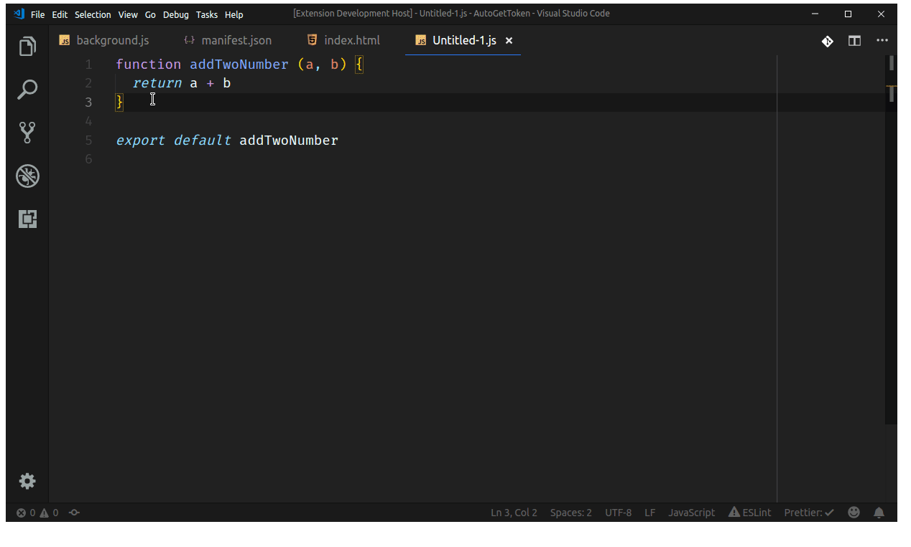
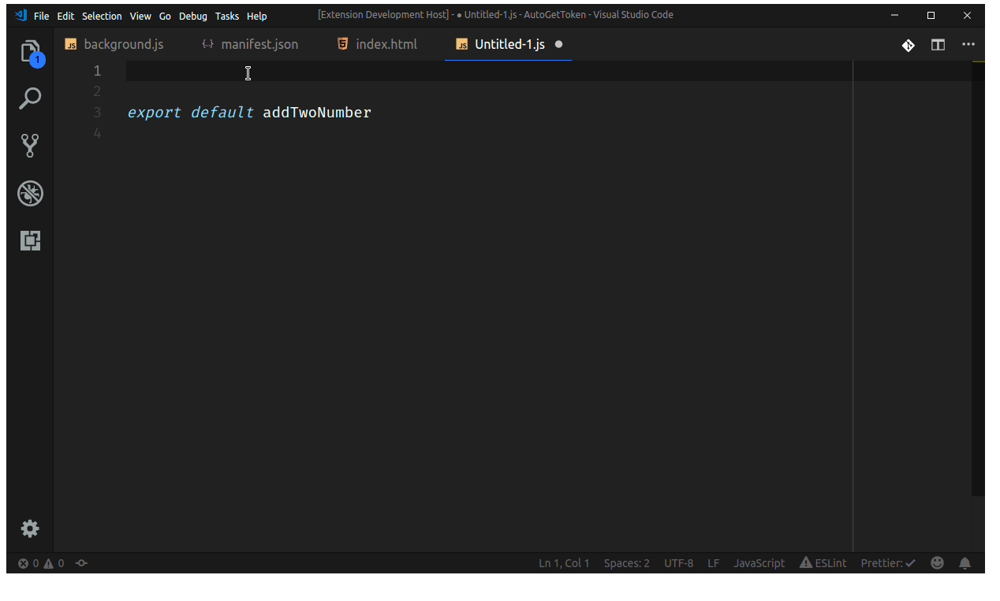

# SnippetStore

[Snippet Store](https://github.com/ZeroX-DG/SnippetStore) integration in Visual Studio Code

## Installation

Type `ctrl + shift + p` or on Mac `cmd + shift + p` to launch command palette and choose Extensions: Install Extension. Search this package and install.

## Requirements

SnippetStore version at least v0.2.6

## Usage

To transfer your code snippet to Snippet Store (Snippet Store must be running at this time):

- Select your code snippet in vscode
- Type shortcut `ctrl + shift + t` or on Mac `cmd + shift + t` or find `Transfer selection to Snippet Store` in vscode right-click menu
- Snippet Store will pop up and allow you to input other info for the snippet
- Hit the save button or keyboard shortcut `ctrl + s` to save

To import snippet code from Snippet Store to vscode (Snippet Store must be running at this time):

- Type shortcut `ctrl + shift + i` or on Mac `cmd + shift + i` or find `Import snippets from Snippet Store` in vscode right-click menu
- A vscode quick pick window will popup and allow you to pick your snippet
- After select your snippet, your snippet will be import into vscode at the cursor position

## Author & Maintainer

- [Hung Nguyen](https://github.com/ZeroX-DG) ([twitter](https://twitter.com/?lang=vi))
